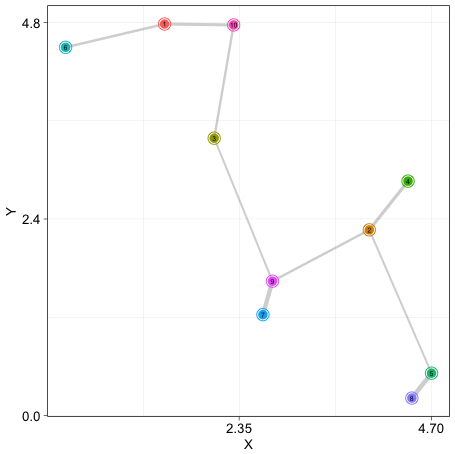
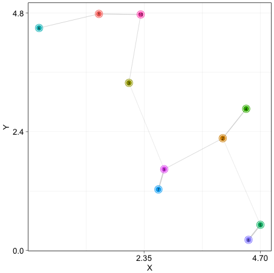
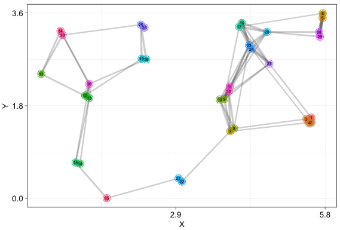
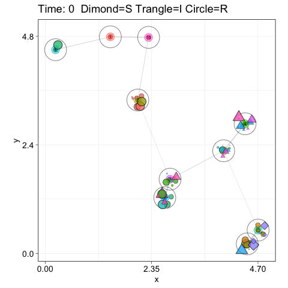

<br>

Examples
====================

<br>

#### Peng He (<phe@ab.mpg.de>)

<br>

Here I illustrate how to generate spatial networks explicitly characterizing the configurational features of animal habitats using the function `ahn_gen()` in the R package [`AnimalHabitatNetwork`](https://cran.r-project.org/web/packages/AnimalHabitatNetwork/index.html). Then, following a fundamental bottom-up perspective/approach and with a simple epidemiological model - [the Susceptible-Infectious-Recovered (SIR) model](https://royalsocietypublishing.org/doi/abs/10.1098/rspa.1927.0118?casa_token=i2PNAdiToOkAAAAA:6jojm7IVriDucIDkYIqPGT9kkFKvgCw98WEiUpoiD7EHyhQAVnwSAPILveX1aRw8iO_UNOPi85wx), I demonstrate how we can use the AnimalHabitatNetowrk model to gain insights on the linkages between the configurational features of the physical habitat environment and the transmission dynamics in animal populations.

When simulating networks, we need to pass the spatial coordinates of habitat patches to the `ahn_gen()` — it accepts *any* spatial layouts of patches in the defined landscapes (see our example below on how to specify coordinates of nodes). For example, we can simulate layouts using tools established in spatial ecology for generating a wide range of point patterns (see *[Baddeley, A., Rubak, E., & Turner, R. (2015). Spatial point patterns: methodology and applications with R. Chapman and Hall/CRC Press](https://books.google.de/books?hl=en&lr=&id=rGbmCgAAQBAJ&oi=fnd&pg=PP1&dq=Spatial+Point+Patterns+Methodology+and+Applications+with+R&ots=2yRQqKC5By&sig=orBwW_KvInRkGpZbnbR24vWJUq8#v=onepage&q=Spatial%20Point%20Patterns%20Methodology%20and%20Applications%20with%20R&f=false)* and the R package [`spatstat`](https://cran.r-project.org/web/packages/spatstat/) on the CRAN). However, if coordinates not specified (i.e. using the default values), the `ahn_gen()` will randomly draw points from the defined landscapes as nodes. In the model, whether two habitat patches are connected for organisms of a species (i.e. if organisms of a species can move between the patches *directly*) is determined by `mu` — which depicts the intrinsic biological attributes of the focal species (e.g. to what extent organisms of a given species are able to penetrate the physical landscape), `lamda` — which depicts the configurational features of the habitat (e.g. the quality of the landscape matrix in terms of its effects on organisms' movements) between habitat patches, and `Dij` — which is the Euclidean distance between the patch `i` and `j` (see properties of the function `P(Dij, mu, lamda) = [1 + exp(-lamda(Dij - mu))]^-1` for determining the presences/absences of links in animal habitat networks in `ahn_prob()` in the package). Thus, these dimensions jointly determine the structural properties of the resulting habitat networks (i.e. the patterns of the presences/absences of links, as indicated by network connectivity). The strength of such potential connections between patches (i.e. the link weights in habitat networks) is, *by default*, the mathematical reciprocal of the Euclidean distance between them; however, such (quantitative) attributes of these potential connections can also be specified (if so desired), for example, by using numeric values simulated with dispersal kernels [e.g. [Urban and Keitt (2001)](https://doi.org/10.1890/0012-9658(2001)082[1205:LCAGTP]2.0.CO;2); see more kernels in Table 15.1, pp. 188-191 in [Clobert, J., Baguette, M., Benton, T. G., & Bullock, J. M. (Eds.). (2012). Dispersal ecology and evolution, Oxford University Press](https://books.google.de/books?hl=en&lr=&id=s3EVDAAAQBAJ&oi=fnd&pg=PP1&dq=dispersal+ecology+and+evolution&ots=LLjDJD2XHo&sig=doPL5iOLgowNgb9gbBq1aTQUCqg#v=onepage&q=dispersal%20ecology%20and%20evolution&f=false); see also our example below on specifying the link weights in the habitat network `ahn_1` using the *negative exponential dispersal kernel* implemented in the R package [`steps` (v1.1.0)](https://cran.r-project.org/web/packages/steps/index.html)].

<br>

### 1. Generating networks depicting habitats with variable configurational features

Install and load the package:

``` r
install.packages("AnimalHabitatNetwork")
library(AnimalHabitatNetwork)
```

<br>

#### 1.1. A simple animal habitat network defined in a square-shaped landscape with the default spatial layout of nodes

Let's first generate a network depicting a simple case that 10 habitat patches for our species are connected but randomly distributed in a 5 × 5 (i.e. square-shaped) landscape with an area of 25, and we assume that the species-specific value for `mu` is 1, and landscape-matrix-specific value `lamda` is 5, and assume we are not interested in the physical attributes of habitat patches (e.g. size, heterogeneity) but the quantitative attributes of potential connections among patches (i.e. a weighted network):

``` r
set.seed(123)
ahn_1 <- ahn_gen(N = 10, # number of patches
                 L = 5, # one dimension of the 2-D spatial extent
                 mu = 1, # species-specific value
                 lamda = 5, # landscape-matrix-specific value
                 Connected = TRUE, # patches are connected
                 Weighted = TRUE, # quantative attributes among patches rather than binary
                 eta = 1, 
                 A = 25, # area (spatial extent) of the landscape
                 X = NULL, # not specified — X coordinates randomly drawn from the uniform distribution
                 Y = NULL, # not specified — Y coordinates randomly drawn from the uniform distribution 
                 U = NULL, # we ignore node attributes
                 V = NULL) # we ignore node attributes
```

Visually check what the network looks like by:

``` r
ahn_plot(ahn_1)
```
{width=40%}

<br>

#### 1.2. Specifying the (numeric) attributes of links

Now assume we want to specify the numeric attributes of potential connections (links) generated in `ahn_1` (e.g. the probability of dispersal/movement between patches), for example, using the *negative exponential dispersal kernel*:

``` r
library(igraph)
Dij <- 1/E(ahn_1)$weight # get the Euclidean distances
expected_mean_dist <- .5 # we assume the expected mean dispersal distance of the species is .5
library(steps) # using the kernel in the 'steps' package
neg_exp_disp_kernel <- exponential_dispersal_kernel(expected_mean_dist)
New_weights <- neg_exp_disp_kernel(Dij)
# the above three lines can be replaced with 'New_weights <- exp(-(Dij)/expected_mean_dist)'
E(ahn_1)$weight <- New_weights
```

Now the network looks like this:

``` r
ahn_plot(ahn_1)
```
{width=40%}

<br>

#### 1.3. Specifying landscape geometry and the spatial layouts of nodes when simulating animal habitat networks

The model allows *ANY* spatial point patterns in the landscape—if we are interested in a set of patches with specific `X` and/or `Y` coordinates in the landscape, we can just pass the `X` and/or `Y` coordinates of these patches to the corresponding arguments (i.e. `X` and/or `Y` in `ahn_gen()`, rather than leave them as defaults). For example, we can simulate some complex yet more realistic patterns of spatial layouts (i.e. `X` and `Y` coordinates) of habitat patches to capture some more natural patterning using some existing algorithms or approaches well established in spatial ecology, such as the [Gauss-Poisson point process](https://doi.org/10.2307/3211969)—which is implemented in the function `rGaussPoisson` in the [R package `spatstat` on the CRAN](https://cran.r-project.org/web/packages/spatstat/index.html) (the package also provides other families of processes/algorithms for generating point patterns, see details in *[Baddeley, A., Rubak, E., & Turner, R. (2015). Spatial point patterns: methodology and applications with R. Chapman and Hall/CRC Press](https://books.google.de/books?hl=en&lr=&id=rGbmCgAAQBAJ&oi=fnd&pg=PP1&dq=Spatial+Point+Patterns+Methodology+and+Applications+with+R&ots=2yRQqKC5By&sig=orBwW_KvInRkGpZbnbR24vWJUq8#v=onepage&q=Spatial%20Point%20Patterns%20Methodology%20and%20Applications%20with%20R&f=false)*):

``` r
set.seed(1)
library(spatstat)
X_max <- 6  
Y_max <- 4
# generate a random spatial layout by the Gauss-Poisson point process in a 6 × 4 landscape
pp <- rGaussPoisson(kappa = 1, r = .09, p2 = .5, win = owin(c(0, X_max),c(0, Y_max)), nsim = 1, drop = TRUE)
plot(pp) # have a look at the point pattern generated
N_patch <- pp[[2]] # get the number of points/patches generated
xcoords <- pp[[3]] # X coordinates in the resulting ppp object generated
ycoords <- pp[[4]] # Y coordinates in the resulting ppp object generated
ahn_2 <- ahn_gen(N = N_patch, 
                 L = X_max, 
                 mu = 1, 
                 lamda = 5, 
                 Connected = TRUE, 
                 Weighted = TRUE, 
                 eta = 1, 
                 A = X_max * Y_max, 
                 X = xcoords, # pass xcoords coordinates we generated to X
                 Y = ycoords, # pass ycoords coordinates we generated to Y
                 U = NULL, 
                 V = NULL)
```

And it looks like this:

``` r
ahn_plot(ahn_2)
```
{width=40%}

<br>

### 2. Simulating individual movements on `ahn_1` and the transmission dynamics of a pathogen in the population

Below we simulate individual movements on a simple habitat network (`ahn_1`, with specified link weights) and the transmission dynamics of a pathogen in a closed population. When simulating individual movements, we assume that at each timestep each individual will stay in its current habitat patch with a probability `ProbStay`, while the probability of moving to a connected neighboring patch is proportional to the corresponding strength of the potential connection between the patches (as indicated by the link weight in our simulated habitat networks). In the SIR model, each individual at each timestep is either susceptible (S), infectious (I) or recovered (R). Initially, we assume a random individual is infectious, and at each timestep, we assume each infectious individual infects each of its susceptible neighbors in the same patch (if any) with a probability `pi`, while each infected individual recovers and acquires immunity with the probability `rho`.

First initialize the values of our parameters:

``` r
N_agent <- 10
ProbStay <- .5
TimeSteps <- 150
pi <- .05
rho <- .01
```

Let's create a data frame to hold the SIR history for each individual:

``` r
SIR_His <- data.frame(ID_Agent = 1:N_agent, SIR_Initial = 0, stringsAsFactors = F)
SIR_His$SIR_Initial[sample(1:N_agent, 1)] <- 1 # initially a random individual is infectious
SIR_His$SIR_Temp <- SIR_His$SIR_Initial
```

Then, we compute the probabilities of individual movements on the network `ahn_1`:

``` r
# note the strength of the connections in this network was specified earlier
AHN_mat <- as_adjacency_matrix(ahn_1, sparse = F, attr = "weight")
MoveProb <- sweep(AHN_mat, 1, (1-ProbStay)/rowSums(AHN_mat), "*")
diag(MoveProb) <- ProbStay
MoveProb[is.na(MoveProb)] <- 0
```

And create a data frame to hold the movement history for each individual:

``` r
Move_His <- data.frame(ID_Agent = 1:N_agent, Site_Initial = sample(1:nrow(AHN_mat), N_agent, replace = T), stringsAsFactors = F)
Move_His$Site_Temp <- Move_His$Site_Initial
```

Now, let's simulate individual movements on the habitat network `ahn_1` and the transmission dynamics of the pathogen in the population for a time window of 150 timesteps:

``` r
for(u in 1:TimeSteps){
  # movement probabilities of individuals
  Probs <- MoveProb[Move_His$Site_Temp, ]
  # individual movements
  Move_His[, u+3] <- apply(Probs, 1, function(x){sample(1:nrow(AHN_mat), 1, prob = x)})
  names(Move_His)[u+3] <- u
  Move_His$Site_Temp <- Move_His[, u+3]
  # we assume that individuals in the same patch contacted each other
  Temp <- outer(Move_His[, u+3], Move_His[, u+3], "==")*1
  diag(Temp) <- 0
  # the contact network
  Contacts <- graph_from_adjacency_matrix(Temp, mode = "undirected")
  ID_I <- which(SIR_His$SIR_Temp == 1) # 1 indicates infectious (I)
  if(length(ID_I) != 0){
    for(v in 1:length(ID_I)){
      # individuals who contacted the focal infectious individual
      Nei_all <- neighbors(Contacts, ID_I[v])
      if(length(Nei_all) != 0){
        for(w in 1:length(Nei_all)){
          if(SIR_His$SIR_Temp[Nei_all[w]] == 0){ # 0 indicates susceptible (S)
            # the infectious individual infects a susceptible individual with pi = .05:
            SIR_His$SIR_Temp[Nei_all[w]] <- sample(c(1, 0), 1, prob = c(pi, 1 - pi))
          }
        }
      }
      # the infectious individual recovers and acquires immunity with the probability of rho = .01
      SIR_His$SIR_Temp[ID_I[v]] <- sample(c(2, 1), 1, prob = c(rho, 1 - rho)) # 2 indicates recovery (R)
    }
    # update the SIR status of each individual
    SIR_His[, u+3] <- SIR_His$SIR_Temp
    names(SIR_His)[u+3] <- u
  }else{
    SIR_His[, u+3] <- SIR_His$SIR_Temp
    names(SIR_His)[u+3] <- u
  }
}
```

Now let's make an animated gif to visualize individual movements and the SIR dynamics on `ahn_1`. Let's retrieve the coordinates of habitat patches:

``` r
Site_Coords <- data.frame(x = vertex_attr(ahn_1, "X", index = V(ahn_1)), 
                          y = vertex_attr(ahn_1, "Y", index = V(ahn_1)), 
                          Site = 1:vcount(ahn_1), stringsAsFactors = F)
```

And adapt the data structure of our results in the `Move_His` and `SIR_His` for visualization:

``` r
library(reshape2)

MOVE <- Move_His[, -3]
names(MOVE)[2] <- 0
MOVE <- melt(MOVE, id = c("ID_Agent"))
names(MOVE)[2] <- "Time"
names(MOVE)[3] <- "Site"

SIR <- SIR_His[, -3]
names(SIR)[2] <- 0
SIR <- melt(SIR, id = c("ID_Agent"))
names(SIR)[2] <- "Time"
names(SIR)[3] <- "SIR"

MOVE$x <- Site_Coords$x[match(MOVE$Site, Site_Coords$Site)]
MOVE$y <- Site_Coords$y[match(MOVE$Site, Site_Coords$Site)]

MOVE$SIR <- SIR$SIR
MOVE$Time <- as.integer(MOVE$Time)
```

Visualize and save the outputs as a gif:

``` r
library(gganimate)
library(ggplot2)
q <- ahn_plot(ahn_1) +
  geom_point(data = Site_Coords, mapping = aes(x = x, y = y), shape = 1, size = 12, alpha = .5, fill = "grey") +
  geom_point(data = MOVE, 
             mapping = aes(x = x, y = y, size = .0075, fill = factor(ID_Agent), shape = factor(SIR)),
             colour = "black", show.legend = FALSE, alpha = .75, 
             position = position_jitter(w = .15, h = .15)) + 
  scale_shape_manual(values = c(23, 24, 21)) + # 23: 0-S-diamond; 24: 1-I-triangle; 21: 2-R-circle
  labs(x = "x", y = "y") +
  transition_time(Time) + 
  labs(title = "Time: {frame_time}  diamond=S triangle=I circle=R") +
  shadow_wake(wake_length = .075, alpha = F)
animate(q, nframes = 150, duration = 30, res = 100)
anim_save("SIR.gif")
```
And it looks like this:

{width=40%}

